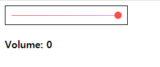

# aj-html-volumecontrol

[물리엔진을 더한 볼륨 컨트롤러 만들기](https://www.youtube.com/watch?v=Fn_spTOeIzM)

-   10번째 프로젝트 (aj)
-   클론 코딩 프로젝트

기존 프로젝트

-   Hammerjs를 이용, pan 이벤드와 panend 이벤트를 활용
-   단순히 deltaY에 상수를 곱하여 회전
-   생각보다 잘된다

챌린지

-   바닐라로 변경. 예상하지 못했던 문제들 출몰
-   잘 안된다 (버벅임이 있다)
-   가만히 잡고있으면 350ms 마다 호출, 근데 과격하게 움직이면 짧은 시간동안 더 여러번 호출됨 (과격하게 움직이면 더 빨리 움직임)
-   Volume 텍스트가 같이 드래그 된다

개선점 (챌린지)

-   left에 붙이려면 코드가 너무 길어짐. class를 활용한 리팩토링 필요해보임
-   버벅임을 방지하기 위해 다른 이벤트리스너를 사용해보기
-   timestamp 역시 활용하기
-   스로틀링 분이기
-   ... 혹은 그냥 라이브러리 이용하기

왜 바닐라로 넘어와보려 했는가

-   pan 이벤트의 제공이 deltaY 밖에 없음
-   그러면 정교하지 않다고 생각했음 (원형으로 arctan 구해서 정확히 해볼 생각)

결론

-   그냥 deltaY 만 사용하고 가속도 등 적용하기 (추천)
-   완전히 deep 하게 파기
